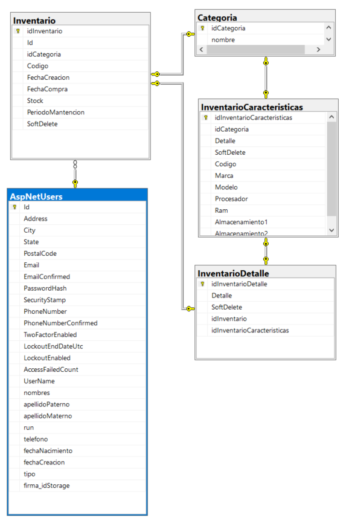

# Insecap Test Project

Proyecto desarrollado en .NET destinado a generar un CRUD de inventarios.

## Modelo ER

  

## Categorías

Para acceder al CRUD categorías se debe acceder a la url `https://localhost:44362/Categoria`.

## Inventario

Para acceder al CRUD de Inventarios categorías se debe acceder a la url `https://localhost:44362/Inventario`.

## Inventario Características

Para acceder al CRUD Inventario Características se debe acceder a la url `https://localhost:44362/InventarioCaracteristicas`.