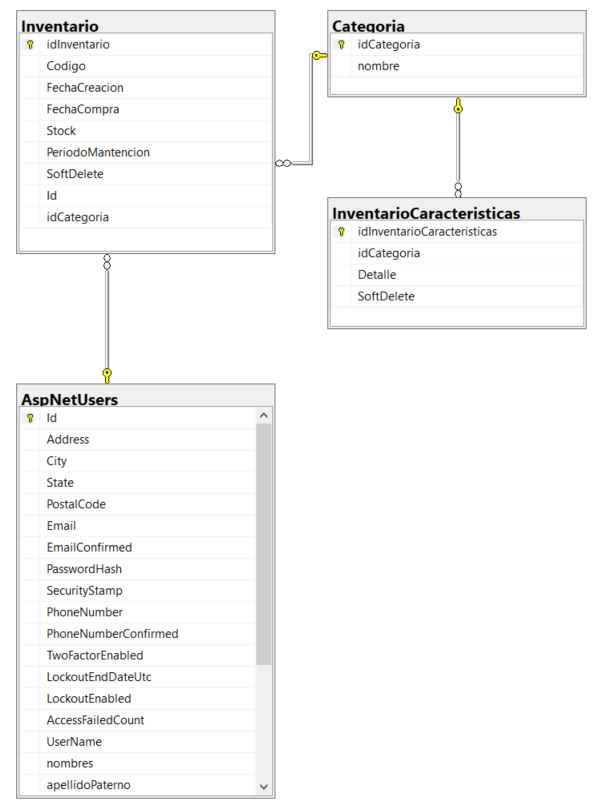
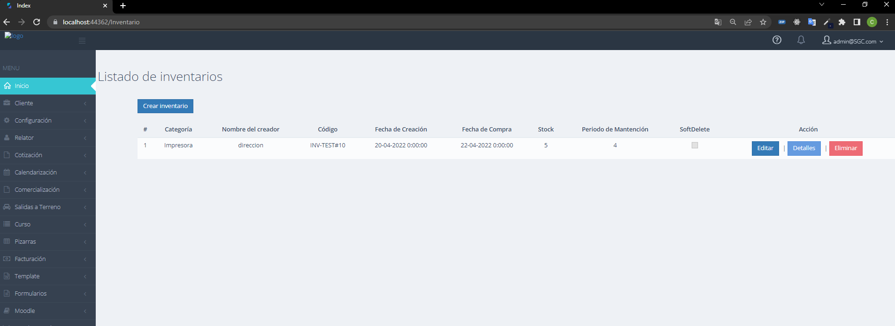
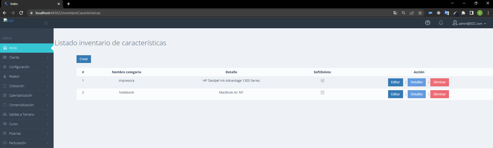

# Insecap Test Project

Proyecto desarrollado en .NET destinado a generar un CRUD de inventarios.

## Modelo ER

  

 

## Categorías

Para acceder al CRUD categorías se debe acceder a la url `https://localhost:44362/Categoria`, en donde se listaran todos los registros de la tabla **Categoria**.

  

 

## Inventario

Para acceder al CRUD de Inventarios categorías se debe acceder a la url `https://localhost:44362/Inventario`, en donde se listaran todos los registros de la tabla **Inventario**.

  

 

## Inventario Características

Para acceder al CRUD Inventario Características se debe acceder a la url `https://localhost:44362/InventarioCaracteristicas`, en donde se listaran todos los registros de la tabla **InventarioCaracteristicas**.

  

